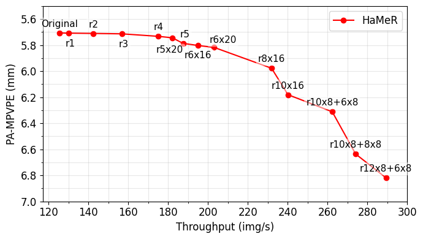

# HaMeR_TMU

TMU integration for **[HaMeR](https://github.com/geopavlakos/hamer)** (Reconstructing Hands in 3D with Transformers). This folder adds TMU’s token-grid restoration to HaMeR’s inference to improve throughput while preserving stable scale and alignment.

---

## Demo: Baseline vs HaMeR+TMU

**What to expect (from our MSc report):**
- ~**25–40%** speedup on HaMeR with **negligible to moderate** accuracy change.
- TMU removes the scale drift seen in merge-only reductions and keeps **lowest vertex error** across reduction levels.

---

## Environment & Pretrained Weights

Please **follow the original [HaMeR](https://github.com/geopavlakos/hamer) repository** to:
1. Install the environment and dependencies.
2. Download the official **pretrained HaMeR weights**.
3. Verify the baseline demo runs successfully.

---
## Results

HaMeR + TMU on FreiHAND: throughput–accuracy trade-off.

  

---

## Acknowledgements
Parts of the code are taken or adapted from the following repos:
- [HaMeR](https://github.com/geopavlakos/hamer)
- [ToMe](https://github.com/facebookresearch/ToMe)

