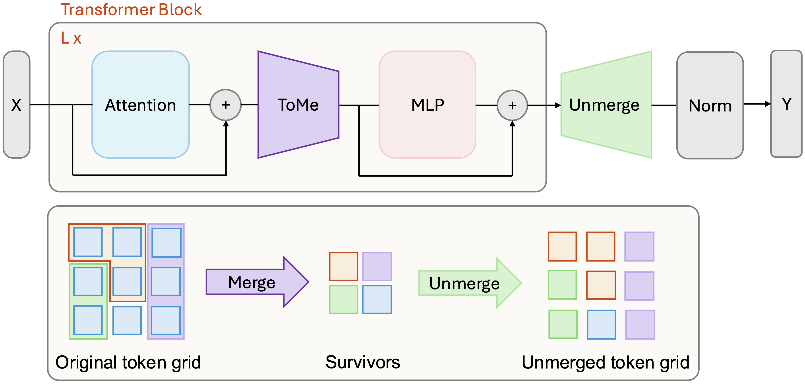
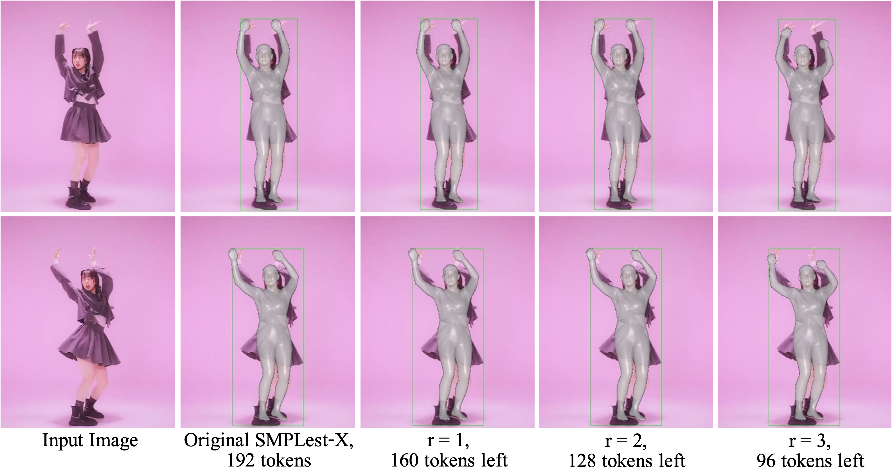

# TMU: Token Merge with Unmerge

**Code repository for the MSc thesis:** TMU: Token Merging with Unmerge for Efficient Hand Pose Estimation



TMU is a **training-free, drop-in technique** for Vision Transformer (ViT) based 3D mesh regression models. It improves inference speed by dynamically merging and unmerging tokens during forward passes while preserving pose accuracy through intelligent token restoration.

## Key Features

- **Training-free**: No retraining required - works with existing pretrained models
- **Drop-in integration**: Simple patching of ViT backbones
- **Speed-accuracy trade-off**: Configurable token reduction levels
- **Preserves accuracy**: Maintains pose quality through unmerge mechanism
- **Multi-model support**: Compatible with HaMeR, WiLoR, and SMPLest-X

## Performance Results

| Model | Speedup | Accuracy Impact | Key Benefits |
|-------|---------|----------------|--------------|
| **[HaMeR](https://github.com/geopavlakos/hamer)** | **25–40%** faster | Negligible to moderate | Lowest vertex error across reduction levels |
| **[WiLoR](https://github.com/rolpotamias/WiLoR)** | Variable | Preserves anatomy | Removes scale drift from merge-only reductions |
| **[SMPLest-X](https://github.com/SMPLCap/SMPLest-X)** | **15–19%** faster | Negligible to moderate | Maintains lowest vertex error |

## Demo Results

### HaMeR + TMU


### WiLoR + TMU


### SMPLest-X + TMU


## How It Works

TMU operates in two phases:
1. **Token Merging**: Reduces computational load by merging similar tokens during forward pass
2. **Token Unmerging**: Restores original token structure to maintain spatial relationships and pose accuracy

The technique uses bipartite soft matching to identify token pairs for merging and tracks source information to enable accurate reconstruction.

## Quick Start

### 1. Choose Your Model Integration

- **[HaMeR_TMU](HaMeR_TMU/)** - Hand mesh reconstruction with transformers
- **[WiLoR_TMU](WiLoR_TMU/)** - End-to-end 3D hand localization and reconstruction  
- **[SMPLest-X_TMU](SMPLest-X_TMU/)** - Expressive human pose and shape estimation

### 2. Setup Environment

Each subfolder contains detailed setup instructions. Follow the original model's installation guide, then apply TMU patches.


### 3. Adjust Token Reduction

Use the `--r` parameter to control the speed-accuracy trade-off:
- `r=0`: No merging (baseline performance)
- `r=[5]*20`: Moderate speedup with minimal accuracy loss
- `r=[10]*16`: Higher speedup with some accuracy trade-off

## Project Structure

```
TMU/
├── HaMeR_TMU/          # HaMeR integration
├── WiLoR_TMU/          # WiLoR integration  
├── SMPLest-X_TMU/      # SMPLest-X integration
└── assets/             # Project assets and figures
```

Each integration folder contains:
- `tmu/` - Core TMU implementation
- `demo.py` - Interactive demo script
- `eval.py` - Evaluation scripts
- `README.md` - Model-specific instructions

## Technical Details

TMU integrates with ViT models by:
1. Patching attention mechanisms to track token merging
2. Implementing bipartite soft matching for token selection
3. Maintaining source tracking matrices for unmerging
4. Preserving task-specific tokens (e.g., MANO parameters, SMPL-X tokens)

## Citation

If you use this code in your research, please cite:

```bibtex
@thesis{wang2025tmu,
  title={TMU: Token Merging with Unmerge for Efficient Hand Pose Estimation},
  author={Ziyi Wang, Rolandos Potamias},
  year={2025},
  school={Imperial College London}
}
```

## Acknowledgments

This work builds upon:
- [ToMe](https://github.com/facebookresearch/ToMe) - Token merging foundation
- [HaMeR](https://github.com/geopavlakos/hamer) - Hand mesh reconstruction
- [WiLoR](https://github.com/rolpotamias/WiLoR) - 3D hand localization
- [SMPLest-X](https://github.com/SMPLCap/SMPLest-X) - Human pose estimation

