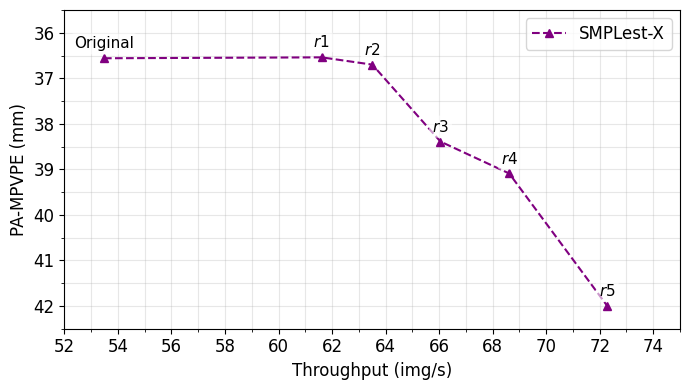

# SMPLest-X_TMU

TMU integration for **[SMPLest-X](https://github.com/SMPLCap/SMPLest-X)** (Ultimate Scaling for Expressive Human Pose and Shape Estimation). This folder adds TMU’s token-grid restoration to SMPLest-X’s backbone to improve throughput while preserving stable scale and alignment.

---

## Demo: Baseline vs SMPLest-X+TMU

**What to expect:**
- **+15–19%** throughput with **negligible to moderate** degradation.

---

## Environment & Pretrained Weights

Please **follow the original [SMPLest-X](https://github.com/SMPLCap/SMPLest-X) repository** to:
1. Install the environment and dependencies.
2. Download the official **pretrained SMPLest-X weights** and prepare the Parametric human models([SMPL-X](https://smpl-x.is.tue.mpg.de/) is used here).
3. Verify the baseline demo runs successfully.

---
## Results

SMPLest-X + TMU on [EHF](https://download.is.tue.mpg.de/download.php?domain=smplx&sfile=EHF.zip): throughput–accuracy trade-off.

  

---

## Acknowledgements
Parts of the code are taken or adapted from the following repos:
- [SMPLest-X](https://github.com/SMPLCap/SMPLest-X)
- [ToMe](https://github.com/facebookresearch/ToMe)

