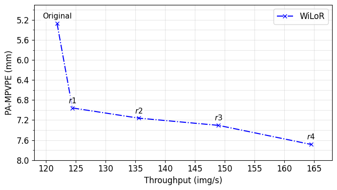

# WiLoR_TMU

TMU integration for **[WiLoR](https://github.com/rolpotamias/WiLoR)** (End-to-end 3D hand localization and reconstruction in-the-wild). This folder adds TMU’s token-grid restoration to WiLoR’s inference to improve throughput while preserving stable scale and alignment.

---

## Demo: Baseline vs WiLoR+TMU

**What to expect:**
- TMU **preserves anatomy** and removes scale drift typical of merge-only reductions.
- On WiLoR, results can be **sensitive to small camera biases**—particularly when in-block smoothing is involved.

---

## Environment & Pretrained Weights

Please **follow the original [WiLoR](https://github.com/rolpotamias/WiLoR) repository** to:
1. Install the environment and dependencies.
2. Download the official **pretrained WiLoR weights**.
3. Verify the baseline demo runs successfully.

---
## Results

WiLoR + TMU on [FreiHAND](https://lmb.informatik.uni-freiburg.de/resources/datasets/FreihandDataset.en.html): throughput–accuracy trade-off.

  

---

## Acknowledgements
Parts of the code are taken or adapted from the following repos:
- [WiLoR](https://github.com/rolpotamias/WiLoR)
- [ToMe](https://github.com/facebookresearch/ToMe)

